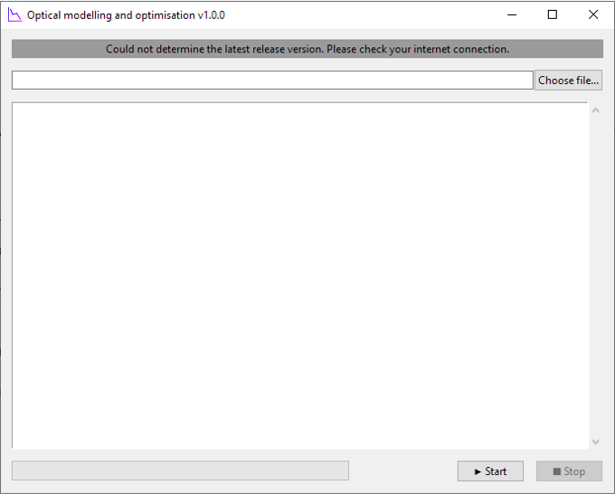
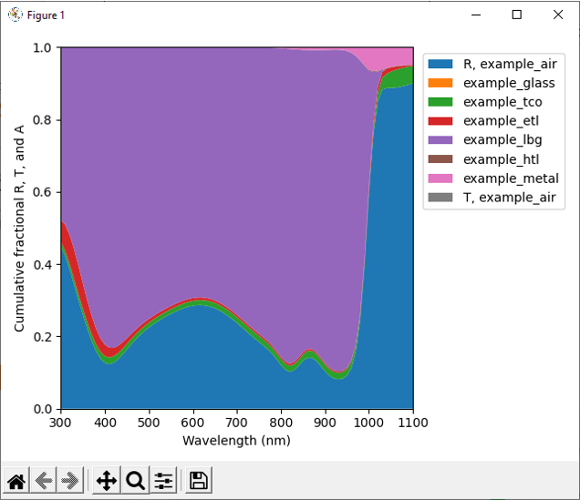
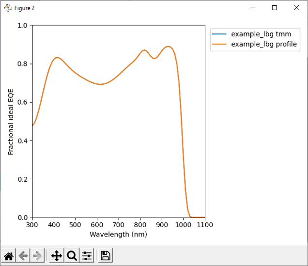
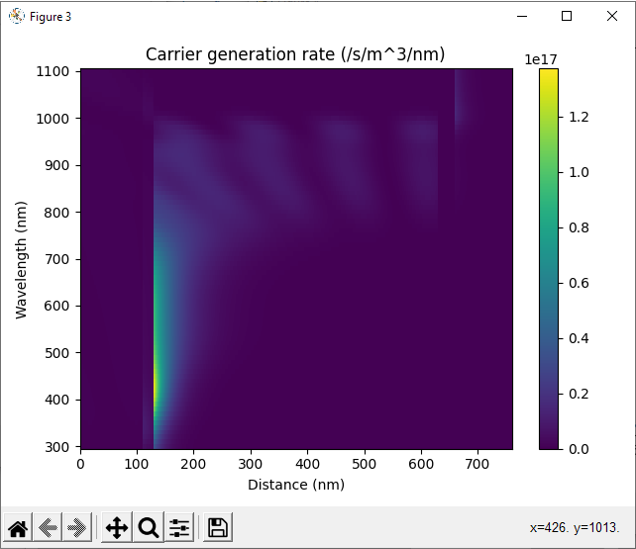
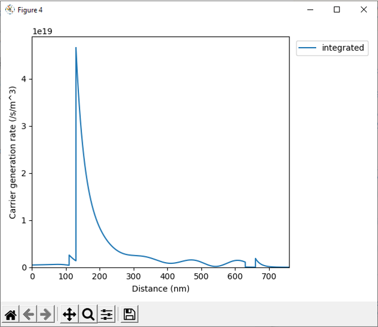

# pv_optics

Simulate and optimise the optical properties of solar cells using the transfer matrix method.

The simulated parameters include spectra of the reflection, transmission, absorption in each layer, carrier generation profiles, and ideal external quantum efficiency, as well as total current generation under specific illumination conditions. These simulated parameters can be used for understanding optical losses, estimating internal quantum efficiency spectra, or as the optical input to full device simulations.

The thicknesses of active layers in the stack can also be optimised based on their optics to maximise photocurrent generation. This is particularly important in multijunction solar cells.

To perform transfer matrix calculations this program leverages the [tmm](https://github.com/sbyrnes321/tmm) module. Further details on the method can be found in [this paper](https://arxiv.org/abs/1603.02720) by the author of the module.

To perform optimisations this program currently supports [Scipy's differential evolution algorithm](https://docs.scipy.org/doc/scipy/reference/generated/scipy.optimize.differential_evolution.html).

## Installation

Create and activate a new virtual environment, e.g. using [conda](https://conda.io/projects/conda/en/latest/user-guide/tasks/manage-environments.html), [venv](https://docs.python.org/3/library/venv.html) etc., with Python version 3.10 (may not work with other versions). Then either [download](https://github.com/jmball/pv_optics/archive/refs/heads/main.zip) and unzip (or clone using [git](https://git-scm.com)) this repository to a location of your choice. Using a terminal, e.g. Anaconda Prompt, with the virtual environment activated, navigate to the newly created directory using, for example:

```
cd C:\Users\Name\Documents\Git\pv_optics
```

The exact folder path you use here will be where you chose to locate the pv_optics folder on your computer.

Then install the dependencies of the program into the virtual environment using:

```
pip install -r requirements.txt
```

## Usage

### Data files

Optical simulations of solar cells requires data files for the complex refractive index spectra of the layers of the device stack. Typically, complex refractive index data will be derived from spectroscopic ellipsometry measurements. Some literature data can be found in online databases e.g. [RefractiveIndex.info](https://refractiveindex.info). Please see the "refractive_index" folder for examples of the data format required by the program when including new material data for a simulation.

Simulating carrier generation profiles and total current generation additionally requires a data file for the spectral irradiance of the illumination source. Please see the "illumination" folder for examples of the data format required by the program when including new illumination source data for a simulation. Reference data for the AM1.5G solar spectrum can be downloaded from [NREL](https://www.nrel.gov/grid/solar-resource/spectra-am1.5.html).

N.B. the example data provided with the program is simulated and not derived from real-world materials.

### Configuration files

The configuration of a simulation and/or optimisation of stack of layers is handled with configuration files located in the "input" folder. Please see the example configuration files, which can be used as templates, for how they should be written and an explanation of the required parameters.

### GUI

From the command line, navigate to the pv_optics folder, activate the Python virtual environment created above, then run the GUI by calling:

```
python pv_optics_gui.py
```

The GUI provides a slightly smoother interface than the command line for loading configuration files and viewing the simulation output.



To use the GUI, load a configuration by pressing the "Choose file..." button in the top right, then press the "Start" button in the bottom right corner. In any text output generated by the simulation will be displayed in the central textbox. To "Stop" a simulation whilst it's running, press the "Stop" button in the bottom right corner.

### Non-GUI

From the command line, navigate to the pv_optics folder, activate the Python virtual environment created above, then run without the GUI by calling:

```
python pv_optics.py --filename [config_file_name.yaml]
```

where `[config_file_name.yaml]` is the name of the simulation configuration file to run, which must be located in the "input" folder.

### Output plots

If selected in the configuration file, several plots may appear on the screen at the end of a simulation/optimisation. This happens regardless of whether the GUI or command line versions of the program are used.



Figure 1 displays the fraction of reflected, absorbed, or transmitted light in each layer of the device stack.



Figure 2 displays the predicted external quantum efficiency spectrum for the device assuming ideal carrier collection. This is equivalent to the fraction of absorbed light in the active layer(s), as specified in the configuration file.



Figure 3 displays the carrier generation rate profiles in the coherent layers of the device stack. If the number of wavelengths for the simulations is 10 or greater, this plot will be a heatmap. For fewer wavelengths this figure will display line plots.



Figure 4 displays the wavelength-integrated carrier generation rate profile in the coherent layers of the device stack.

In the bottom left corner of each plot window there are a few tools for manipulating or saving the plots.

### Output files

If selected in the configuration file, the output data created by a simulation/optimisation can be saved for further processing without needing to re-run the simulation. This data can be found in the "output" folder, which is automatically created on first use of the program. Each time a simulation is run and data output is required, a new data folder is created, which is named with the timestamp corresponding to the start of the simulation. Data is never overwritten.

The saved data can include: the reflection, absorption, and transmission data for each layer (the data shown in Figure 1, which includes the data shown in Figure 2), which will be in the \*\_rta.tsv file; the carrier generation rate profiles at each wavelength (the data shown in Figure 3), which will be in the \*\_G.tsv file; and the optimisation output data, which will be in the \*\_optimisation_output.yaml file. A copy of the configuration file used to generate the output is also saved there so even if the original file is modified, there's always a record of how the data in a folder was created.

### Optimisations

Thickness optimisation runs can take a long time. You should expect that it will take several minutes to optimise the thickness of one or two layers, but it could take several hours to optimise more layers than that.
